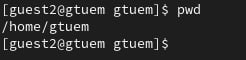

---
## Front matter
title: "Шаблон отчёта по лабораторной работе N3"
subtitle: "Дискреционное разграничение прав в Linux. Два пользователя"
author: "Туем Гислен"

## Generic otions
lang: ru-RU
toc-title: "Содержание"

## Bibliography
bibliography: bib/cite.bib
csl: pandoc/csl/gost-r-7-0-5-2008-numeric.csl

## Pdf output format
toc: true # Table of contents
toc-depth: 2
lof: true # List of figures
lot: true # List of tables
fontsize: 12pt
linestretch: 1.5
papersize: a4
documentclass: scrreprt
## I18n polyglossia
polyglossia-lang:
  name: russian
  options:
	- spelling=modern
	- babelshorthands=true
polyglossia-otherlangs:
  name: english
## I18n babel
babel-lang: russian
babel-otherlangs: english
## Fonts
mainfont: PT Serif
romanfont: PT Serif
sansfont: PT Sans
monofont: PT Mono
mainfontoptions: Ligatures=TeX
romanfontoptions: Ligatures=TeX
sansfontoptions: Ligatures=TeX,Scale=MatchLowercase
monofontoptions: Scale=MatchLowercase,Scale=0.9
## Biblatex
biblatex: true
biblio-style: "gost-numeric"
biblatexoptions:
  - parentracker=true
  - backend=biber
  - hyperref=auto
  - language=auto
  - autolang=other*
  - citestyle=gost-numeric
## Pandoc-crossref LaTeX customization
figureTitle: "Рис."
tableTitle: "Таблица"
listingTitle: "Листинг"
lofTitle: "Список иллюстраций"
lotTitle: "Список таблиц"
lolTitle: "Листинги"
## Misc options
indent: true
header-includes:
  - \usepackage{indentfirst}
  - \usepackage{float} # keep figures where there are in the text
  - \floatplacement{figure}{H} # keep figures where there are in the text
---

# Цель работы

Получение практических навыков работы в консоли с атрибутами фай-
лов для групп пользователей.

# Задание
1. Создать второго пользователя guest2.
2. Добавить пользователя guest2 в группу guest
3. Заполните табл. 3.1
4. Заполните табл. 3.2

# Выполнение лабораторной работы

создайте учётную запись пользователя guest2 и задайте пароль для пользователя guest2 (рис. [-@fig:001]).

Добавьте пользователя guest2 в группу guest (рис. [-@fig:002]).

Осуществите вход в систему от двух пользователей на двух разных кон-солях: guest на первой консоли и guest2 на второй консоли. (рис. [-@fig:003]).

Для обоих пользователей командой pwd определите директорию, в которой вы находитесь (рис. [-@fig:004]).

для второго (рис. [-@fig:005])
Уточните имя вашего пользователя, его группу, кто входит в неё и к каким группам принадлежит он сам. (рис. [-@fig:006]).

Сравните полученную информацию с содержимым файла /etc/group. (рис. [-@fig:007]).

От имени пользователя guest2 выполните регистрацию пользователя guest2 в группе guest  (рис. [-@fig:008]).

От имени пользователя guest измените права директории /home/guest, разрешив все действия для пользователей группы: (рис. [-@fig:009]).

От имени пользователя guest снимите с директории /home/guest/dir1 все атрибуты (рис. [-@fig:0010]).

Заполните табл. 3.1 (рис. [-@fig:0011]).

{#fig:001 width=70%}

{#fig:002 width=70%}

{#fig:003 width=70%}

{#fig:004 width=70%}

{#fig:005 width=70%}

{#fig:006 width=70%}

{#fig:007 width=70%}

{#fig:009 width=70%}

{#fig:0010 width=70%}

{#fig:0011 width=70%}

# Выводы

Эта лаборатория позволяет нам реально манипулировать правами доступа между пользователями.
