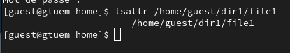
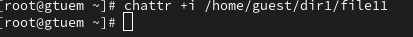

---
## Front matter
title: "Шаблон отчёта по лабораторной работе N4"
subtitle: "Дискреционное разграничение прав в Linux. Расширенные атрибуты"
author: "Туем Гислен"

## Generic otions
lang: ru-RU
toc-title: "Содержание"

## Bibliography
bibliography: bib/cite.bib
csl: pandoc/csl/gost-r-7-0-5-2008-numeric.csl

## Pdf output format
toc: true # Table of contents
toc-depth: 2
lof: true # List of figures
lot: true # List of tables
fontsize: 12pt
linestretch: 1.5
papersize: a4
documentclass: scrreprt
## I18n polyglossia
polyglossia-lang:
  name: russian
  options:
	- spelling=modern
	- babelshorthands=true
polyglossia-otherlangs:
  name: english
## I18n babel
babel-lang: russian
babel-otherlangs: english
## Fonts
mainfont: PT Serif
romanfont: PT Serif
sansfont: PT Sans
monofont: PT Mono
mainfontoptions: Ligatures=TeX
romanfontoptions: Ligatures=TeX
sansfontoptions: Ligatures=TeX,Scale=MatchLowercase
monofontoptions: Scale=MatchLowercase,Scale=0.9
## Biblatex
biblatex: true
biblio-style: "gost-numeric"
biblatexoptions:
  - parentracker=true
  - backend=biber
  - hyperref=auto
  - language=auto
  - autolang=other*
  - citestyle=gost-numeric
## Pandoc-crossref LaTeX customization
figureTitle: "Рис."
tableTitle: "Таблица"
listingTitle: "Листинг"
lofTitle: "Список иллюстраций"
lotTitle: "Список таблиц"
lolTitle: "Листинги"
## Misc options
indent: true
header-includes:
  - \usepackage{indentfirst}
  - \usepackage{float} # keep figures where there are in the text
  - \floatplacement{figure}{H} # keep figures where there are in the text
---

# Цель работы

Получение практических навыков работы в консоли с расширенными атрибутами файлов.

# Задание

Здавать или отзывать права доступа к файлам и документам.

# Выполнение лабораторной работы

От имени пользователя guest определить расширенные атрибуты файла /home/guest/dir1/file1 (рис. [-@fig:001]).

На файл file1 права, разрешающие чтение и запись для владельца файла. (рис. [-@fig:002]).

Попробовать установить на файл /home/guest/dir1/file1 расширенный атрибут a от имени пользователя guest (рис. [-@fig:003]).

Зайдиавать на третью консоль с правами администратора либо повысьте свои права с помощью команды su. Попробовать установить расширенный атрибут a на файл /home/guest/dir1/file1 от имени суперпользователя (рис. [-@fig:004]).

От пользователя guest проверить правильность установления атрибута: (рис. [-@fig:005]).

Выполнить дозапись в файл file1 слова «test» и выполнить чтение файла file1 (рис. [-@fig:006]).

Попробовать удалить файл file1 либо стереть имеющуюся в нём информацию и попробовать переименовать файл (рис. [-@fig:007]).

Попробуйте установить на файл file1 права, например, запрещающие чтение и запись для владельца файла (рис. [-@fig:008]).

Снимите расширенный атрибут a с файла /home/guest/dirl/file1 от имени суперпользователя  (рис. [-@fig:009]).

Повторить операции, которые вам ранее не удавалось выполнить. (рис. [-@fig:0010]).

Снимите расширенный атрибут i с файла /home/guest/dirl/file1 от имени суперпользователя командой (рис. [-@fig:0011]).

Повторитm действия по шагам, заменив атрибут a атрибутом i (рис. [-@fig:0012]).

{#fig:001 width=70%}

{#fig:002 width=70%}

{#fig:003 width=70%}

{#fig:004 width=70%}

{#fig:005 width=70%}

{#fig:006 width=70%}

{#fig:007 width=70%}

{#fig:008 width=70%}

{#fig:009 width=70%}

{#fig:0010 width=70%}

{#fig:0011 width=70%}

{#fig:0012 width=70%}

# Выводы

результате выполнения работы вы повысили свои навыки использования 
 интерфейса командой строки (CLI), познакомились на примерах с тем,
 как используются основные и расширенные атрибуты при разграничении
 доступа. Имели возможность связать теорию дискреционного разделения
 доступа (дискреционная политика безопасности) с её реализацией на практике 
 в ОС Linux. Составили наглядные таблицы, поясняющие какие операции 
 возможны при тех или иных установленных правах. Опробовали действие на практике расширенных атрибутов «а» и «i».

