---
## Front matter
title: "Шаблон отчёта по проект 2"
subtitle: "Установка DVWA"
author: "Туем Гислен"

## Generic otions
lang: ru-RU
toc-title: "Содержание"

## Bibliography
bibliography: bib/cite.bib
csl: pandoc/csl/gost-r-7-0-5-2008-numeric.csl

## Pdf output format
toc: true # Table of contents
toc-depth: 2
lof: true # List of figures
lot: true # List of tables
fontsize: 12pt
linestretch: 1.5
papersize: a4
documentclass: scrreprt
## I18n polyglossia
polyglossia-lang:
  name: russian
  options:
	- spelling=modern
	- babelshorthands=true
polyglossia-otherlangs:
  name: english
## I18n babel
babel-lang: russian
babel-otherlangs: english
## Fonts
mainfont: PT Serif
romanfont: PT Serif
sansfont: PT Sans
monofont: PT Mono
mainfontoptions: Ligatures=TeX
romanfontoptions: Ligatures=TeX
sansfontoptions: Ligatures=TeX,Scale=MatchLowercase
monofontoptions: Scale=MatchLowercase,Scale=0.9
## Biblatex
biblatex: true
biblio-style: "gost-numeric"
biblatexoptions:
  - parentracker=true
  - backend=biber
  - hyperref=auto
  - language=auto
  - autolang=other*
  - citestyle=gost-numeric
## Pandoc-crossref LaTeX customization
figureTitle: "Рис."
tableTitle: "Таблица"
listingTitle: "Листинг"
lofTitle: "Список иллюстраций"
lotTitle: "Список таблиц"
lolTitle: "Листинги"
## Misc options
indent: true
header-includes:
  - \usepackage{indentfirst}
  - \usepackage{float} # keep figures where there are in the text
  - \floatplacement{figure}{H} # keep figures where there are in the text
---

# Цель работы

Установить DVWA в гостевую систему к Kali Linux.

# Задание

1. Скачать DVWA
2. Настройка DVWA
3. Настройка База данных
4. Настройка сервера Apache
5. Откройте DVWA в своем веб-браузере

# Теоретическое введение

1. Установите DVWA в гостевую систему к Kali Linux.
2. Репозиторий: https://github.com/digininja/DVWA.
3. Некоторые из уязвимостей веб приложений, который содержит DVWA:

        Брутфорс: Брутфорс HTTP формы страницы входа - используется для тестирования инструментов по атаке на пароль методом грубой силы и показывает небезопасность слабых паролей.
        
        Исполнение (внедрение) команд: Выполнение команд уровня операционной системы.
        
        Межсайтовая подделка запроса (CSRF): Позволяет «атакующему» изменить пароль администратора приложений.
        
        Внедрение (инклуд) файлов: Позволяет «атакующему» присоединить удалённые/локальные файлы в веб приложение.
        
        SQL внедрение: Позволяет «атакующему» внедрить SQL выражения в HTTP из поля ввода, DVWA включает слепое и основанное на ошибке SQL внедрение.
        
        Небезопасная выгрузка файлов: Позволяет «атакующему» выгрузить вредоносные файлы на веб сервер.
        
        Межсайтовый скриптинг (XSS): «Атакующий» может внедрить свои скрипты в веб приложение/базу данных. DVWA включает отражённую и хранимую XSS.
        
        Пасхальные яйца: раскрытие полных путей, обход аутентификации и некоторые другие.
        
    DVWA имеет три уровня безопасности, они меняют уровень безопасности каждого веб приложения в DVWA:
    
        Невозможный — этот уровень должен быть безопасным от всех уязвимостей. Он используется для сравнения уязвимого исходного кода с безопасным исходным кодом.
        
        Высокий — это расширение среднего уровня сложности, со смесью более сложных или альтернативных плохих практик в попытке обезопасить код. Уязвимости не позволяют такой простор эксплуатации как на других уровнях.
        
        Средний — этот уровень безопасности предназначен главным образом для того, чтобы дать пользователю пример плохих практик безопасности, где разработчик попытался сделать приложение безопасным, но потерпел неудачу.
        
        Низкий — этот уровень безопасности совершенно уязвим и совсем не имеет защиты. Его предназначение быть примером среди уязвимых веб приложений, примером плохих практик программирования и служить платформой обучения базовым техникам эксплуатации.

# Выполнение лабораторной работы

1. клонировать репозиторий DVWA GitHub(рис. [-@fig:001]).

2. назначьте разрешения на чтение, запись и выполнение (777) для папки DVWA[-@fig:002]).

3. посмотреть содержимое каталога конфигурации и создать копию файла с именем config.inc.php(рис. [-@fig:003]).

4. Теперь откройте файл config.inc.php в редакторе nano, чтобы выполнить необходимые настройки(рис. [-@fig:004]).

5. запустить службу MySQL и проверьте, запущена ли служба(рис. [-@fig:005]).

6. войти в базу данных(рис. [-@fig:006]).

7. создайте нового пользователя и предоставьте этому пользователю полные права доступа к базе данных dvwa(рис. [-@fig:007]).

8. запустите терминал и выполните мониторинг в каталоге /etc/php/8.2/apache2, а затем выполните команду sudo nano php.ini, найдите строкиallow_url_fopen иallow_url_include и убедитесь, что для обоих установлено значение «ON»(рис. [-@fig:008]).

9. запустите и посмотрите статус apache2(рис. [-@fig:009]).

10. Запустите веб-браузер и введите URL-адрес: 127.0.0.1/DVWA(рис. [-@fig:0010]).

11. Нажмите кнопку «Создать/сбросить базу данных» в конце страницы(рис. [-@fig:0011]).

12. После успешного входа в систему вас встретит домашняя страница DVWA.(рис. [-@fig:0012]).

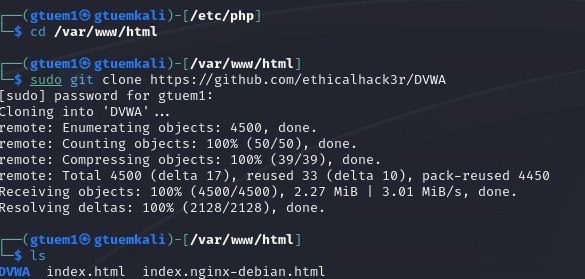{#fig:001 width=70%}

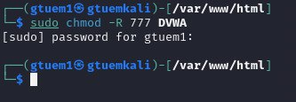{#fig:002 width=70%}

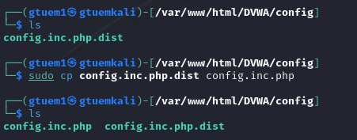{#fig:003 width=70%}

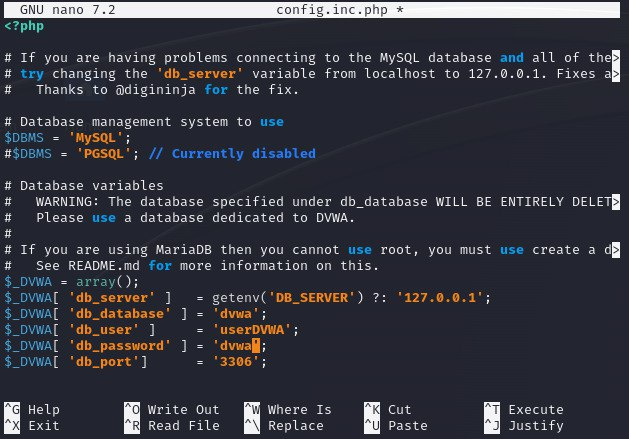{#fig:004 width=70%}

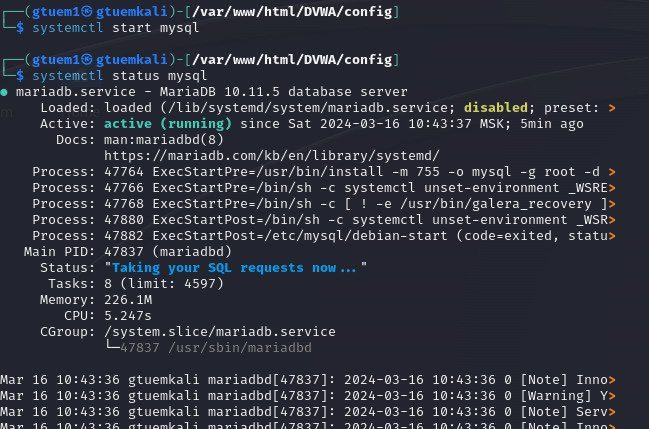{#fig:005 width=70%}

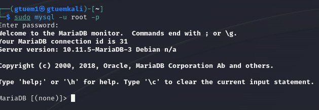{#fig:006 width=70%}

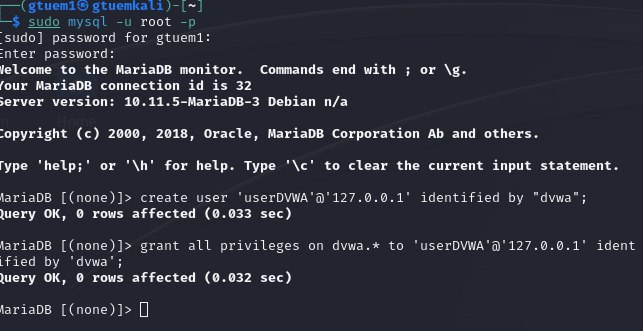{#fig:007 width=70%}

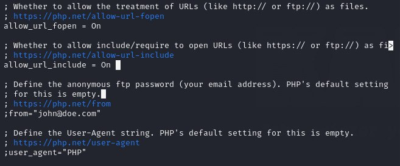{#fig:008 width=70%}

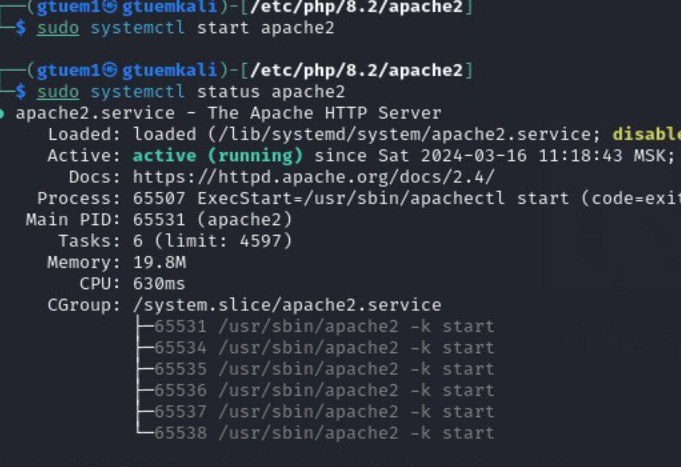{#fig:009 width=70%}

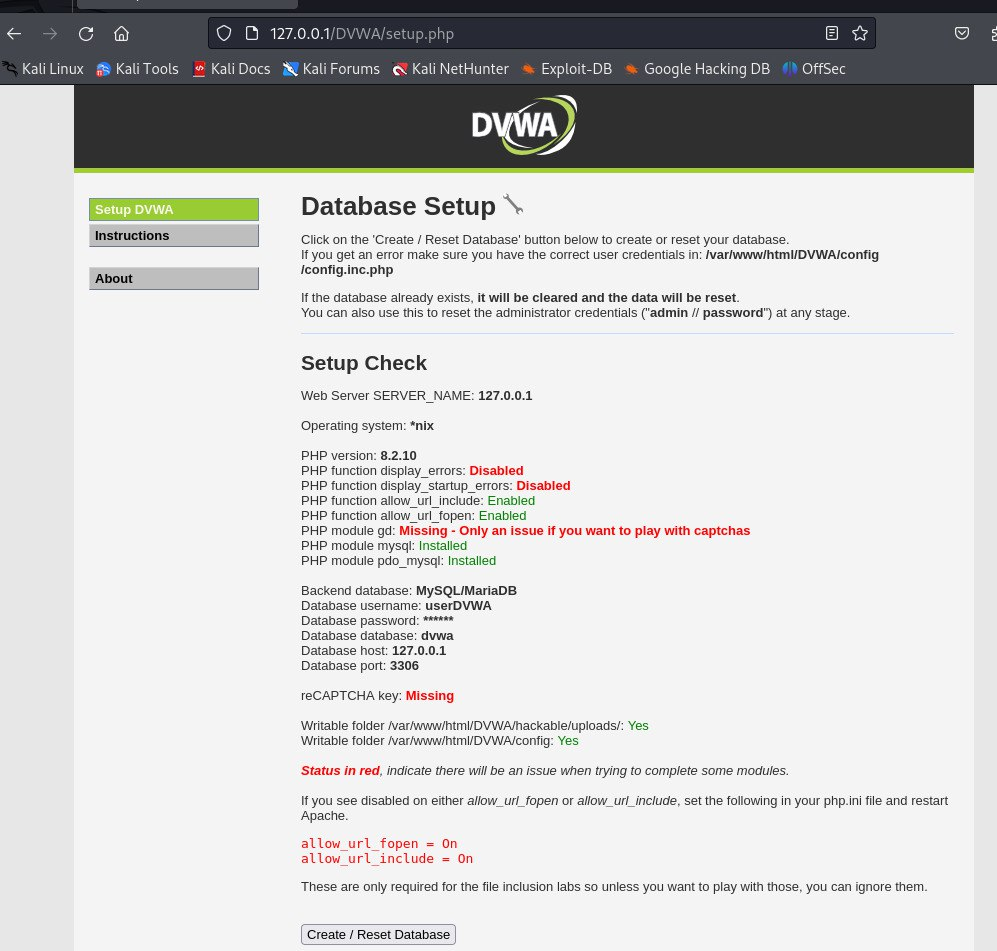{#fig:0010 width=70%}

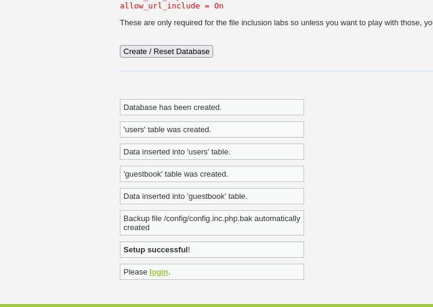{#fig:0011 width=70%}

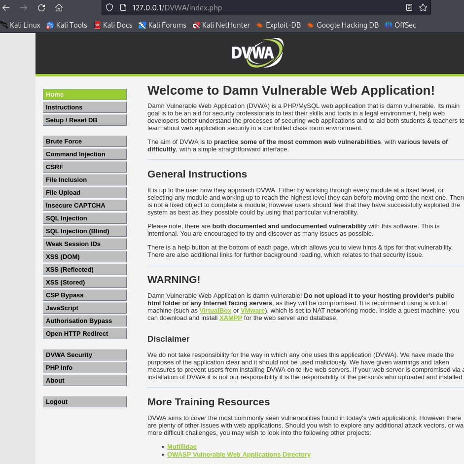{#fig:0012 width=70%}

# Выводы

DVWA — отличная платформа как для начинающих, так и для опытных пользователей благодаря многоуровневой поддержке безопасности. Я считаю, что этот пост дал вам подробное руководство по настройке DVWA в вашей системе Kali Linux.

